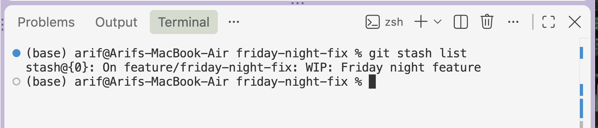
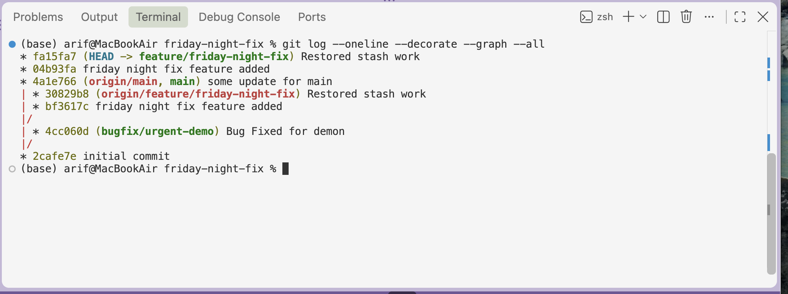
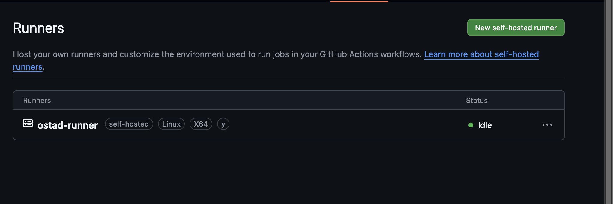
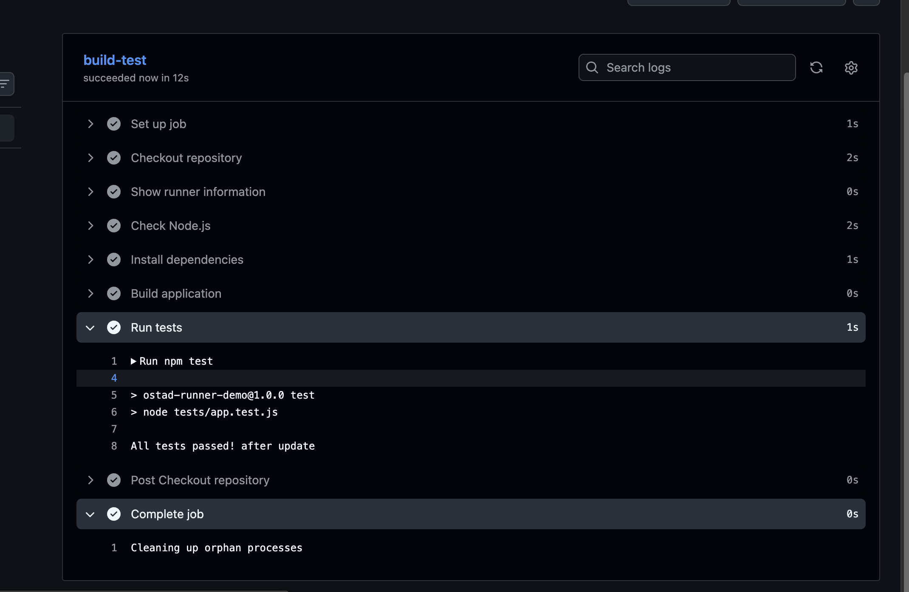
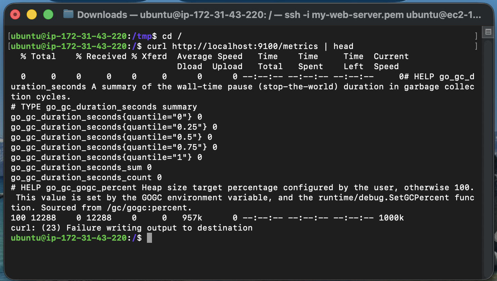
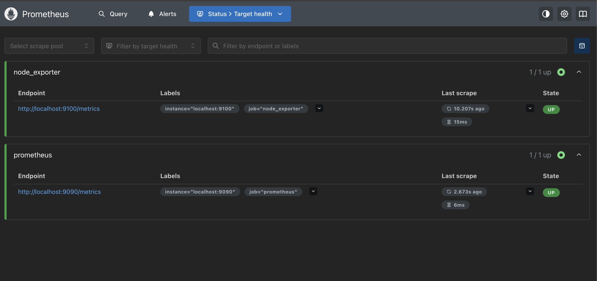
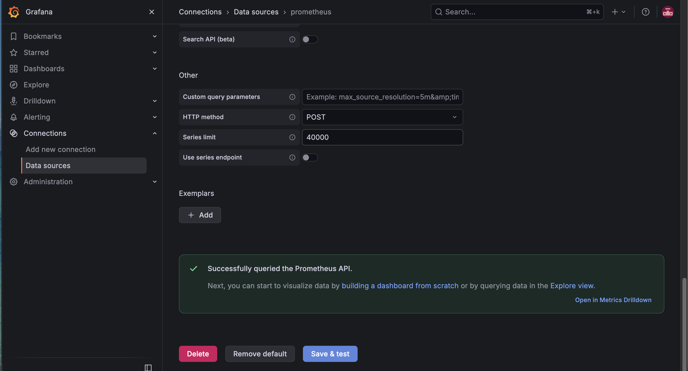
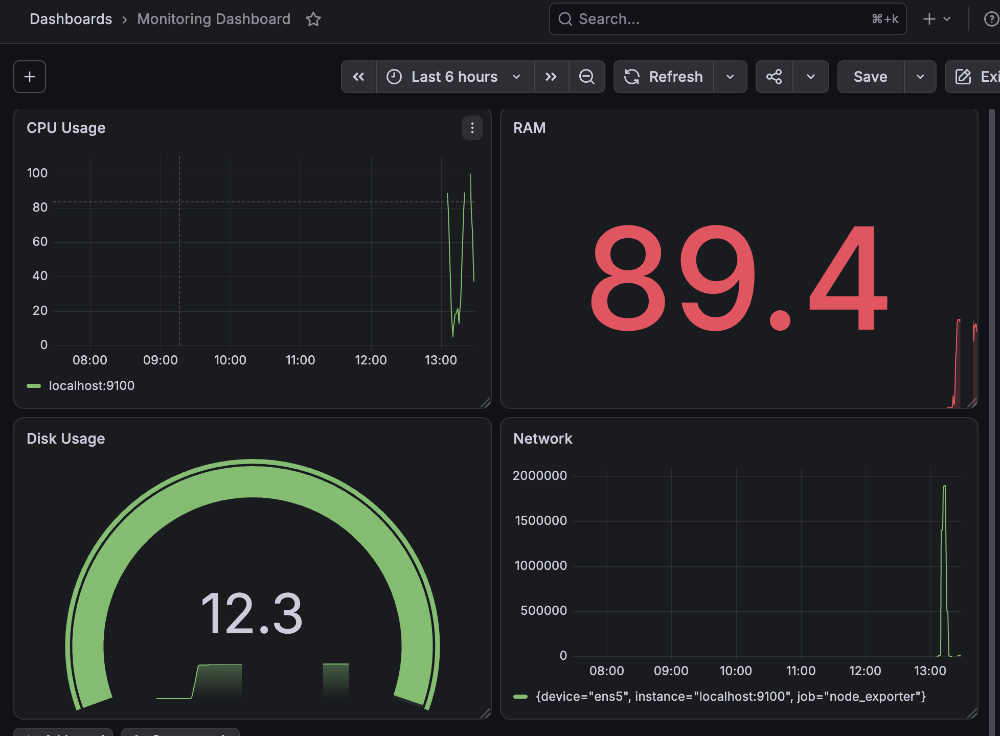

# DevOps Assignment Documentation

## Server Monitoring, Logging, Git Workflow & CI Pipeline

**Student:** Arif Muhammad  
**Date:** 06 October 2026

---

# 1. Introduction

This document describes the DevOps tasks completed as part of the assignment.

The work covers:

- Git branching and branch management
- Git stash
- Git merge
- Git rebase
- GitHub Actions
- Self-hosted GitHub Actions runner
- Successful CI job execution on an EC2 instance
- Node Exporter installation and verification
- Prometheus installation and configuration
- Prometheus target monitoring
- Grafana installation and Prometheus datasource configuration
- Grafana monitoring dashboard for CPU, memory, disk and network

The objective was to understand and demonstrate a basic DevOps workflow from source-code management and CI to server monitoring.

---

# 2. Git Branching and Version Control

Git was used to manage the source code and demonstrate different branching and collaboration workflows.

## 2.1 Git Branching

Git branches allow developers to work on different features or fixes independently without directly modifying the main branch.

The following branches were used during the assignment:

- `main`
- `feature/friday-night-fix`
- `feature-merged`
- `feature-rebased`
- `bugfix/urgent-demo`

### Branching Workflow

A typical workflow used in the project was:

```text
                    feature/friday-night-fix
                   /
main -------------+
                   \
                    bugfix/urgent-demo
```

Branches make it possible to develop and test changes independently before integrating them into the main codebase.

### Screenshot

> **Screenshot: Git branches**
>
> [Git Branch](branch.png)


---

# 3. Git Stash

`git stash` was used to temporarily save uncommitted changes.

This is useful when a developer is working on one task but needs to switch to another branch without committing incomplete work.

Typical commands:

```bash
git stash
git stash list
git stash pop
```

### Explanation

- `git stash` temporarily stores uncommitted changes.
- `git stash list` displays available stashes.
- `git stash pop` restores the most recent stash and removes it from the stash list.

This allows unfinished work to be safely put aside while another task is handled.

### Screenshot



---

# 4. Git Merge

Git merge was used to combine changes from one branch into another branch.

For example:

```bash
git checkout main
git merge feature/friday-night-fix
```

A merge preserves the branch history and may create a merge commit.

Conceptually:

```text
A---B---C---------M   main
     \           /
      D---E-----    feature
```

The merge commit `M` combines the histories of the two branches.

### Screenshot

> [Git Merge](merge.png)
>
> 

---

# 5. Git Rebase

Git rebase was also demonstrated to understand how a branch can be moved onto the latest version of another branch.

Example:

```bash
git checkout feature/friday-night-fix
git rebase main
```

Unlike merge, rebase creates a more linear project history.

Conceptually:

```text
Before:

A---B---C        main
     \
      D---E      feature


After rebase:

A---B---C---D'---E'    feature
```

The commits `D` and `E` are recreated as `D'` and `E'` on top of the latest `main`.

### Merge vs Rebase

| Merge | Rebase |
|---|---|
| Preserves original branch history | Rewrites commit history |
| Can create a merge commit | Produces a linear history |
| Safer for already-published shared branches | Useful for cleaning up local feature branches |
| Shows where branches were combined | Makes history easier to read |

### Screenshot

> 

---

# 6. GitHub Actions CI

GitHub Actions was used to automate the build/test workflow.

The project contains a workflow under:

```text
.github/workflows/
```

The workflow is executed by a GitHub Actions runner.

A simplified workflow structure is:

```yaml
name: Build and Test

on:
  push:
  pull_request:

jobs:
  build-test:
    runs-on: self-hosted

    steps:
      - name: Checkout
        uses: actions/checkout@v4

      - name: Run tests
        run: |
          # test/build commands
```

The `actions/checkout` step downloads the repository contents onto the runner so that subsequent steps can work with the project files.

---

# 7. Self-Hosted GitHub Actions Runner

A self-hosted GitHub Actions runner was configured on an Ubuntu EC2 instance.

Instead of using GitHub-hosted infrastructure, the workflow job runs directly on the configured EC2 server.

The runner was configured with the required label:

```text
self-hosted
```

The runner can receive jobs from GitHub and execute the workflow commands on the EC2 machine.

## Runner Status

When the runner is connected but not currently executing a workflow, its status is:

```text
Idle
```

`Idle` means the runner is online and available to accept a job. It does **not** mean that the runner is disconnected.

### Screenshot

> **Screenshot: GitHub self-hosted runner**
>
> 

---

# 8. Successful CI Job on EC2

A GitHub Actions workflow was triggered and successfully executed on the EC2 self-hosted runner.

The successful workflow demonstrates that:

```text
Developer
    |
    v
GitHub Repository
    |
    v
GitHub Actions
    |
    v
Self-Hosted Runner
    |
    v
EC2 Ubuntu Server
    |
    v
Build / Test Commands
```

The successful job confirms that GitHub can communicate with the self-hosted runner and that the runner can execute the workflow successfully.

### Screenshot

> **Screenshot: Successful GitHub Actions job**
>
> 

---

# 9. Node Exporter

Node Exporter was installed on the Ubuntu EC2 server to expose hardware and operating-system metrics for Prometheus.

Node Exporter exposes metrics through HTTP, normally on:

```text
http://localhost:9100/metrics
```

The metrics include information about:

- CPU
- Memory
- Disk
- Filesystem
- Network
- Load
- Operating-system statistics

Node Exporter was configured as a systemd service so that it starts automatically.

A typical verification command is:

```bash
sudo systemctl status node_exporter
```

The metrics endpoint can also be checked with:

```bash
curl http://localhost:9100/metrics
```

### Screenshot

> **Screenshot: Node Exporter**
>
> 

---

# 10. Node Exporter Ready Status

The Node Exporter service was verified to be running and exposing metrics.

The important verification is that the service is active and the metrics endpoint responds successfully.

Example:

```text
Active: active (running)
```

This confirms that Node Exporter is available for Prometheus to scrape.


# 11. Prometheus

Prometheus was manually installed and configured on the Ubuntu EC2 server.

Prometheus is responsible for:

1. Scraping metrics from Node Exporter.
2. Storing the collected time-series data.
3. Providing a PromQL query interface.
4. Making metrics available to Grafana.

The Prometheus configuration contains a Node Exporter scrape target.

A typical configuration is:

```yaml
scrape_configs:
  - job_name: "node_exporter"
    static_configs:
      - targets: ["localhost:9100"]
```

After configuration, Prometheus was started as a systemd service.

---

# 12. Prometheus Target Status

The Prometheus Targets page was used to verify that Prometheus can successfully communicate with Node Exporter.

The Node Exporter target should appear as:

```text
UP
```

This is important because it confirms the complete monitoring path:

```text
Node Exporter
      |
      | metrics
      v
Prometheus
      |
      | PromQL
      v
Grafana
```

A target with status `UP` means Prometheus successfully scraped the target.

### Screenshot

> **Screenshot: Prometheus target status**
>
> 

---

# 13. Prometheus Metrics / Query Verification

Prometheus was also verified by querying Node Exporter metrics.

For example:

```promql
node_cpu_seconds_total
```

The query returns CPU-related time-series data from Node Exporter.

Other useful metrics include:

```promql
node_memory_MemTotal_bytes
```

```promql
node_filesystem_size_bytes
```

```promql
node_network_receive_bytes_total
```

These metrics demonstrate that Prometheus is successfully receiving data from Node Exporter.

---

# 14. Grafana

Grafana was installed on the Ubuntu EC2 server and configured to visualize Prometheus metrics.

Grafana provides dashboards and panels for monitoring server performance.

The monitoring architecture is:

```text
Ubuntu EC2 Server
       |
       +-------------------+
       |                   |
       v                   v
Node Exporter          Grafana
       |                   ^
       v                   |
   Prometheus -------------+
```

Grafana uses Prometheus as its datasource and executes PromQL queries to display monitoring data.

---

# 15. Grafana Prometheus Datasource

Prometheus was added as a datasource in Grafana.

The Prometheus server URL was configured according to the server setup.

After saving the datasource, Grafana was tested to verify that the connection was successful.

A successful datasource connection confirms that Grafana can communicate with Prometheus and retrieve monitoring data.

### Screenshot

> **Screenshot: Grafana Prometheus datasource**
> 

---

# 16. Grafana Monitoring Dashboard

A Grafana dashboard was created to monitor the EC2 server.

The dashboard contains four main panels:

1. CPU Usage
2. Memory Usage
3. Disk Usage
4. Network Traffic

These panels use PromQL queries against metrics collected by Node Exporter.

---

## 16.1 CPU Usage

### PromQL

```promql
100 - (
  avg by (instance) (
    rate(node_cpu_seconds_total{
      job="node_exporter",
      mode="idle"
    }[5m])
  ) * 100
)
```

### Description

This query calculates the percentage of CPU currently being used.

It calculates the idle CPU percentage and subtracts it from 100.

**Unit:** Percent (0-100)

---

## 16.2 Memory Usage

### PromQL

```promql
(
  1 - (
    node_memory_MemAvailable_bytes{
      job="node_exporter"
    }
    /
    node_memory_MemTotal_bytes{
      job="node_exporter"
    }
  )
) * 100
```

### Description

This query calculates the percentage of system memory currently in use.

**Unit:** Percent (0-100)

---

## 16.3 Disk Usage

### PromQL

```promql
(
  1 -
  (
    node_filesystem_avail_bytes{
      job="node_exporter",
      mountpoint="/",
      fstype!~"tmpfs|overlay"
    }
    /
    node_filesystem_size_bytes{
      job="node_exporter",
      mountpoint="/",
      fstype!~"tmpfs|overlay"
    }
  )
) * 100
```

### Description

This query calculates the percentage of the root (`/`) filesystem that is currently being used.

**Unit:** Percent (0-100)

---

## 16.4 Network Traffic

### PromQL

```promql
rate(node_network_receive_bytes_total{
  job="node_exporter",
  device!="lo"
}[5m])
+
rate(node_network_transmit_bytes_total{
  job="node_exporter",
  device!="lo"
}[5m])
```

### Description

This query calculates the total network traffic received and transmitted by the server.

The loopback interface (`lo`) is excluded so that only actual network-interface traffic is monitored.

**Unit:** Bytes/sec

---

# 17. Grafana Dashboard Result

The final Grafana dashboard provides a single view of the server's main resource usage.

The four panels represent:

| Panel | Metric | Unit |
|---|---|---|
| CPU Usage | CPU utilization | Percent |
| Memory Usage | RAM utilization | Percent |
| Disk Usage | Root filesystem utilization | Percent |
| Network Traffic | Receive + transmit traffic | Bytes/sec |

### Screenshot

> **Screenshot: Final Grafana dashboard**
>
> 
---

# 18. Overall Architecture

The completed environment can be represented as follows:

```text
                         GitHub
                           |
                           | Git Push / Pull Request
                           v
                  +-------------------+
                  | GitHub Actions    |
                  +-------------------+
                           |
                           | Job
                           v
                  +-------------------+
                  | Self-Hosted       |
                  | GitHub Runner     |
                  +-------------------+
                           |
                           v
                  +-------------------+
                  | Ubuntu EC2        |
                  | Server            |
                  +-------------------+
                     |             |
                     |             |
                     v             v
              Node Exporter      CI Jobs
                     |
                     | Metrics :9100
                     v
                +----------+
                |Prometheus|
                +----------+
                     |
                     | PromQL
                     v
                +----------+
                | Grafana  |
                +----------+
                     |
                     v
             Monitoring Dashboard
```

---

# 19. Verification Checklist

The following components were successfully configured and verified:

- [x] Git branches created and managed
- [x] Git stash demonstrated
- [x] Git merge demonstrated
- [x] Git rebase demonstrated
- [x] GitHub Actions workflow configured
- [x] Self-hosted GitHub Actions runner configured
- [x] Runner connected and available
- [x] CI job successfully executed on EC2
- [x] Node Exporter installed
- [x] Node Exporter running/ready
- [x] Prometheus installed
- [x] Prometheus configured to scrape Node Exporter
- [x] Prometheus target showing `UP`
- [x] Grafana installed
- [x] Prometheus added as Grafana datasource
- [x] Grafana datasource connection verified
- [x] CPU monitoring panel created
- [x] Memory monitoring panel created
- [x] Disk monitoring panel created
- [x] Network monitoring panel created

---

# 20. Conclusion

This assignment demonstrated an end-to-end DevOps environment using Git, GitHub Actions, an EC2-based self-hosted runner, Prometheus, Node Exporter, and Grafana.

The Git section demonstrated practical source-control workflows including branching, stash, merge, and rebase.

The CI section demonstrated how GitHub Actions can execute jobs on a self-hosted Ubuntu EC2 runner.

The monitoring section demonstrated how Node Exporter collects server metrics, Prometheus scrapes and stores those metrics, and Grafana visualizes them through a monitoring dashboard.

The final environment therefore provides both:

- **CI automation** through GitHub Actions and the self-hosted runner.
- **Server monitoring** through Node Exporter, Prometheus, and Grafana.

This provides a practical foundation for a basic DevOps workflow and monitoring environment.
